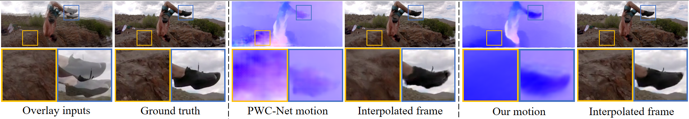
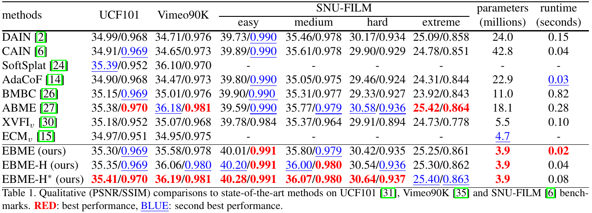

# Enhanced Bi-directional Motion Estimation for Video Frame Interpolation


## Introduction


This project is an implementation of our WACV 2023 paper, [Enhanced
Bi-directional Motion Estimation for Video Frame
Interpolation](https://arxiv.org/abs/2206.08572).

We refer our frame interpolation method as **EBME** (**E**nhanded
**B**i-directional **M**otion **E**stimation for video frame interpolation).
Our motion estimator is designed by carefully adapting the ingredients (e.g.,
warping, correlation) in optical flow research for simultaneous bi-directional
motion estimation within a flexible pyramid recurrent framework. It is extremely
lightweight (15x smaller than PWC-Net), yet enables reliable handling of large
and complex motion cases. Based on estimated bi-directional motions, we employ a
synthesis network to fuse forward-warped representations and predict the
intermediate frame. Our method achieves excellent performance on a broad range
of frame interpolation benchmarks.


## Preparation
#### Python and Cuda environment
Our code has been tested with PyTorch 1.6 and Cuda 10.2. We believe that it is
also compatible with higher version of PyTorch. CuPy package is required for
running the forward warping operation (refer to
[softmax-splatting](https://github.com/sniklaus/softmax-splatting) for details).
```
conda create --name ebme python=3.7
conda activate ebme
conda install pytorch==1.6.0 torchvision==0.7.0 cudatoolkit=10.2 -c pytorch
pip3 install cupy_cuda102==9.4.0
pip3 install -r requirements.txt
```

If your Cuda version is lower than 10.2 (not lower than 9.2), we suggest to
replace `cudatoolkit=10.2` in above command with `cudatoolkit=9.2`, and replace
`cupy_cuda102==9.4.0` with `cupy_cuda92==9.6.0`.


#### Trained model weights
We have placed our trained model weights in `./checkpoints`. The weight of our
base version of EBME model is placed in `./checkpoints/ebme`, and the weight of
our high-resolution version of model is placed in `./checkpionts/ebme-h`.


#### Training and test datasets
We train our model on Vimeo90K dataset, and evaluate it on Vimeo90K, UCF101,
SNU-FILM, and 4K1000FPS.

If you want to train and benchmark our model, please download
[Vimeo90K](http://toflow.csail.mit.edu/),
[UCF101](https://liuziwei7.github.io/projects/VoxelFlow),
[SNU-FILM](https://myungsub.github.io/CAIN/),
[4K1000FPS](https://github.com/JihyongOh/XVFI#X4K1000FPS).


## Play with demo
We provide a script to test our frame interpolation pipeline, given two
consecutive input frames, and the desired time step. Run the following command,
then you will obtain interpolated frame and bi-directional flows in the
`./demo/output` directory.
```
python3 -m demo.interp_imgs \
--frame0 demo/images/caption0.png \
--frame1 demo/images/caption1.png \
--time_period 0.5
```
Here the `time_period` (float number in 0~1) indicates the time step of the
intermediate frame you want to interpolate.

## Training on Vimeo90K
By default, our model is trained on Vimeo90K.  We have set default
hyper-parameters for training, except for the path of training dataset. You can
run the following command to train our base version of EBME:
```
CUDA_VISIBLE_DEVICES=0,1 python3 -m torch.distributed.launch \
    --nproc_per_node=2 --master_port=10000 -m tools.train \
        --world_size=2 \
        --data_root /path/to/vimeo_triplet \
        --train_log_root /path/to/train_log \
        --exp_name ebme-baseline \
        --batch_size 16 \
        --nr_data_worker 2
```
Please assign the root dir to save logs. Otherwise, all training logs will be
saved in `../ebme-train-log` by default.

If you want to train our high-resolution version of EBME, we suggest to use 4
GPUs for training, and slightly change some hyper-parameters.
```
CUDA_VISIBLE_DEVICES=0,1,2,3 python3 -m torch.distributed.launch \
    --nproc_per_node=4 --master_port=10000 -m tools.train \
        --world_size=4 \
        --data_root /path/to/vimeo_triplet \
        --train_log_root /path/to/train_log \
        --exp_name ebme-high-resolution \
        --high_synthesis True \
        --batch_size 8 \
        --nr_data_worker 4
```


All data generated during the training process (including the trained models)
will be saved in `./train-log` directory. We intentionally soft link
`../embe-train-log`  to `./train-log`, in order to avoid saving files under dir
of this codebase.

## Benchmarking
#### Benchmarking scripts
We provide scripts to test frame interpolation accuracy on Vimeo90K, UCF101,
SNU-FILM, and 4K1000FPS. You should configure the path to benchmark datasets
when running these scripts.

```
python3 -m tools.benchmark_vimeo90k --data_root /path/to/vimeo_triplet/
python3 -m tools.benchmark_ucf101 --data_root /path/to/ucf101/
python3 -m tools.benchmark_snufilm --data_root /path/to/SNU-FILM/
python3 -m tools.benchmark_8x_4k1000fps --test_data_path /path/to/4k1000fps/test
```

In order to benchmark our high-resolution version of EBME, you need to change
the path of model file, and set `high_synthesis` as `True`.

Additionally, run the following command can test our runtime.
```
python -m tools.runtime
```

#### Our benchmarking results
Our benchmarking results on UCF101, Vimeo90K, SNU-FILM are shown in below table.
You can verify our results by running our benchmarking scripts. Runtime is
measured with a single 2080TI GPU for interpolating two 640x480 frames.



Our benchmarking results on 4K1000FPS are shown in below table.


## Acknowledgement
We borrow some codes from
[RIFE](https://github.com/megvii-research/ECCV2022-RIFE) and
[softmax-splatting](https://github.com/sniklaus/softmax-splatting). We thank the
authors for their excellent work. When using our code, please also pay attention
to the license of RIFE and softmax-splatting.


## Citation
```
@inproceedings{jin2023enhanced,
  title={Enhanced Bi-directional Motion Estimation for Video Frame Interpolation},
  author={Xin, Jin and Longhai, Wu and Guotao, Shen and Youxin, Chen and Jie,
  Chen and Jayoon, Koo and Cheul-hee, Hahm},
  booktitle={Proceedings of the IEEE/CVF Winter Conference on Applications of Computer Vision (WACV)},
  year={2023}
}
```
